<div align="center">


<br/>


[](https://github.com/alana-britoc)

</div>


## 👩‍💻 About Me

```python
class AlanaBrito:
    def __init__(self):
        self.name        = "Alana Brito"
        self.role        = "Software Engineering Student"
        self.focus       = ["Full Stack", "Automation", "Best Practices"]
        self.learning    = ["Advanced TypeScript", "Docker", "Automated Testing"]
        self.hobby       = "Solving problems with code (and lots of coffee ☕)"

    def mission(self):
        return "Building solutions that make a difference, one line of code at a time."
```


## 🚀 Tech Stack

### 🗣️ Languages


### 🧩 Frameworks & Libraries


### 🗄️ Databases


### 🤖 AI & Automation


### 🛠️ Tools


## 🏆 Trophies

<div align="center">

[](https://github.com/ryo-ma/github-profile-trophy)

</div>


## 📊 GitHub Stats

<div align="center">
  
  
</div>

<div align="center">
  
</div>


## 📈 Recent Activity

<div align="center">

[](https://github.com/ashutosh00710/github-readme-activity-graph)

</div>


## 🌸 Meu jardim de contribuições

<div align="center">
  
</div>

<p align="center"><i>Cada dia com commit desabrocha em uma flor — quanto mais commits, maior ela fica 🌱🌿🌷🌸</i></p>


## 📫 Let's connect!

<div align="center">

[](https://www.linkedin.com/in/alana-cavalcanti)
[](mailto:britoalanac@gmail.com)
[](https://www.behance.net/alanabrito12)

<br/>


</div>


